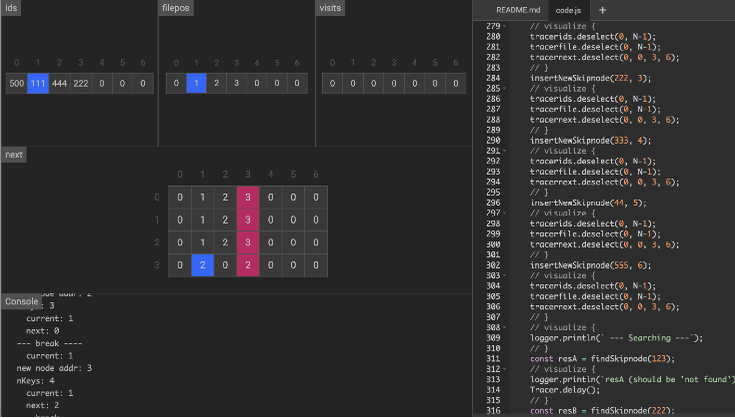

# IncludeDB

An [stb](https://github.com/nothings/stb/)-style *#include*-only single-header k/v store implemented in 
C99 with an emphasis on easy-of-use. <em>Small file database (!)</em> best suited for environments with 
limited resources or in situations where a more complex database library would be an overkill such as 
small games.

<span style="font-weight:bold;">Use this in your Arduino/Playdate/WASM Game!!</span>


## Financing

This project is entirely self-financed and we NEED your support!
Ensure smooth-sailing & regular updates by donating &#129372;s below: 

<a href="https://www.buymeacoffe.com/professorPeanut" target="_blank"></a>

lnbc169690n1pj2jm89pp5wxlx47arg3nu2sajfdu5uq3u2dgs0d5hvzhv60rv5lzu8h5h4z5qdqu2askcmr9wssx7e3q2dshgmmndp5scqzzsxqyz5vqsp52m4d5w2gwauz4nhn4jypempvq4wuxef7unvzgmfppggwpdpn5j3s9qyyssqveag435teq0uhfp4mgzxp8p2q534kans7ns4sgegvq5qrg628djjk4s3jnmu72d5wvnclm03ts5u883jv6jvqnj9847sk03yplj9thspdgp6v3
<p>

</p>
bc1qpv63qlpec3x3lh2cejmr5audh2c6j2ar3ptvy235hld3f2wwzr5sg4qr5n
<p>

</p>
bitcoincash:qzfy6xcw93s8605rywcwug3vpf5kmy5ywgw0lw5lj0
<p>

</p>
LPM7ueXta6kFwCnBKd5viJDX2CN8eLsg3b
<p>

</p>
47NF2hjeMXMMCHu6XNyMrWeJwkndaTNvGAKAQuy6v9wvNTHViVwi3BGTr8wy9U4aoNbDcLMEf7dVjNGvQacttGc3CjEJgP8
<p>

</p>
<em> &#129704; Let's cook this stonesoup together!!! &#129704; </em>


### Status

**Attention!! This project is still *alpha* and many things have yet to be implemented:**
- mmap
- Support for concurrent read
- Support for thread-safe write
- Proper Windows support
- *delete()*ing a key/value pair
- recover keys
- benches
- maybe more stuff, I'm open for suggestions...
- **A logo is needed!** If you would like to volunteer to make one that would be super appreciated!!!

### Table of Contents
- [Financing](#financing)
- [Building](#building)
  - [Generate](#generate)
  - [Demo](#demo)
  - [Compile-time testing](#compile-time-tests)
- [Using](#using)
  - [Screenshots](#screenshots)
  - [Javascript visualization](javascript-visualization)
  - [Known issues](#known-issues)
- [Contributing](#contributing)
- [Similar projects](#similar-projects)
- [Sponsors](#sponsors)

## Building
A build process is not required, simply drop *includedb.h* into your project and use.
#### Generate
If needed, use ``python generate.py`` to create the _"includedb.h"_ file
#### Demo
Building the example program can be done with just ``cc -o demo demo_includedb.c`` When run, a _"hello.dat"_ file will be created.
#### Compile-time tests
If compiled as C++ a number of unit-tests will be executed during compilation. To disable this behaviour ```#define DISABLE_TESTS``` before *#include "includedb.h"*

## Using
_**Attention** This code is not yet production-ready! Proceed accordingly!_

Configuration:
More options, such as setting a different malloc()/free() are available. Take a look inside *includedb.h*
```
// Chunk size is 256 by default. This is the MINIMUM size
// a key/value pair is going to take up. To set a custom value:
#define INCLUDEDB_CHUNK_SIZE 1024 // Optional

// After that add
#define INCLUDEDB_IMPLEMENTATION // Required!
// And finally
#include "includedb.h"

```
Usage:
```
// Create new or open existing. NULL is returned 
// in case the file couldn't be opened or created:
includeDB *mydb = includedb_open("hello.dat");

// read/write/etc...

// Make sure to call close() after done using:
includedb_close(mydb);
```
The database can also be operated entirely during compile time, providing you with a compile-time key/value store.

*Attention!* All operations are synchronous, locking has not yet been implemented. See above^ to help financing!

```
Super easy to use, only 7 functions needed:

includedb_put(instance, key, keylen, val, vallen)
includedb_get(instance, key, keylen, vallen)
includedb_next(instance)
includedb_curGetKey(instance, keylen)
includedb_open(filename)
includedb_close(instance)
includedb_getError(instance)

WARNING! None of these are thread-safe (yet!) Make sure to avoid concurrent access*

*until I have found the time to fix this...
```


### Screenshots
#### Javascript visualization
*algo-visualize.js* is provided and can be run on https://algorithm-visualizer.org/ to show the mechanism of the underlying algorithm. 
<p>

</p>

#### Known issues
Depending on available resources these will be fixed over time.
Issues:
- 'includedb_put()' may call 'includedb__write()' with uninitialized data 
- bloomfilters implemented but not used
- node promotion overflow bug
- missing tests
- missing locks (threads)
- missing locks (file)
- missing reverse cursor
- missing mmap
- missing error check/correction
- missing (good) documentation!
- much much more... ;(

## Contributing
I hope the code is somewhat readable and not too much of a mess. Either way contributions are very welcome, feel free to msg me or issue a request!
Join: https://discord.gg/dJxnkNwE

## Similar projects
IncludeDB is a "storage engine", not a full database. Designed specifically for *small* files (<250mb). Depending on your requirements we encourage you to check out these:

[RocksDB](https://github.com/facebook/rocksdb) High performance, log based k/v 

[LMDB](https://github.com/LMDB/lmdb) Very popular                                              

[NuDB](https://github.com/CPPAlliance/NuDB) Header only k/v

[SQLite](https://github.com/sqlite/sqlite) Battle tested. Popular in browsers/etc. 

[Unqlite](https://github.com/symisc/unqlite)          

[Sparkey](https://github.com/spotify/sparkey)
                                                                                                  
## Sponsors

